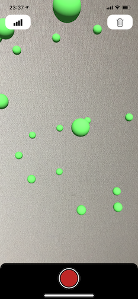

# VisualizationKit

**VisualizationKit** is a sample iOS app for displaying sensor data using ARKit.

This app was developed inspired by [AR Sensor](https://play.google.com/store/apps/details?id=com.ken.arsensor&rdid=com.ken.arsensor) which is an AR app for Android released on Google Play.

## Features
- [x] Display Wifi Strength
- [x] Display Cellular Strength
- [x] Display Magnet Strength
- [x] Display Bluetooth Strength

## Getting Started

### Requirements

* iOS 12.0+
* Xcode 10.0+
* Swift 4.2+

## Author

Watanabe Toshinori – toshinori_watanabe@tiny.blue

## License

This project is licensed under the MIT License. See the [LICENSE](LICENSE) file for details.
